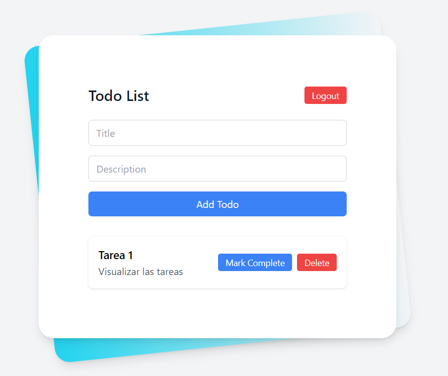

# 📝 Todo App con Arquitectura Hexagonal

- React
- TypeScript
- Node.js
- Express
- MongoDB

Una aplicación fullstack de gestión de tareas con arquitectura hexagonal, combinando un frontend moderno en React con un robusto backend en Node.js.



## 🌟 Características

- ✅ Autenticación de usuarios
- 📋 CRUD completo de tareas
- 📱 Interfaz de usuario responsive
- 🔄 API RESTful
- 🧱 Arquitectura hexagonal para mejor mantenibilidad

## 🏗 Estructura del Proyecto

El proyecto está dividido en dos partes principales:

### 🖥 Frontend (frontend-todo)

- ⚛️ React 18
- 🔷 TypeScript
- ⚡ Vite
- 🛣 React Router
- 🔌 Axios
- 🎨 TailwindCSS

### 🖧 Backend (todo-api)

- 🚂 Express
- 🔷 TypeScript
- 🍃 MongoDB con Mongoose
- 🔑 JWT para autenticación
- 🔒 Bcrypt para encriptación de contraseñas

## 🛠 Requisitos Previos

- Node.js (v14.x o superior)
- npm o yarn
- MongoDB

## 🚀 Instalación

### Frontend

1. Navega al directorio del frontend:
   ```
   cd frontend-todo
   ```

2. Instala las dependencias:
   ```
   pnpm install
   ```

3. Inicia el servidor de desarrollo:
   ```
   pnpm run dev
   ```

🌐 El frontend estará disponible en `http://localhost:5173`

### Backend

1. Navega al directorio del backend:
   ```
   cd todo-api
   ```

2. Instala las dependencias:
   ```
   pnpm install
   ```

3. Configura las variables de entorno:
   Crea un archivo `.env` en la raíz del proyecto backend con las siguientes variables:
   ```
    MONGODB_URI=
    PORT=
    JWT_SECRET=
    JWT_REFRESH_EXPIRATION=15m
    JWT_REFRESH_EXPIRATION=7d
    BCRYPT_SALT_ROUNDS=10
    NODE_ENV=development
   ```

1. Inicia el servidor de desarrollo:
   ```
   pnpm run dev
   ```

🖧 El backend estará disponible en `http://localhost:3000`

## 📜 Scripts Disponibles

### Frontend

| Comando | Descripción |
|---------|-------------|
| `npm run dev` | Inicia el servidor de desarrollo |
| `npm run build` | Compila el proyecto para producción |
| `npm run lint` | Ejecuta el linter |
| `npm run preview` | Previsualiza la build de producción |

### Backend

| Comando | Descripción |
|---------|-------------|
| `npm run start` | Inicia el servidor en modo producción |
| `npm run dev` | Inicia el servidor en modo desarrollo |
| `npm run build` | Compila el proyecto TypeScript |
| `npm run test` | Ejecuta los tests con Jest |

## 🔒 Seguridad

El backend implementa varias medidas de seguridad:

- 🛡 Helmet para la seguridad de los headers HTTP
- 🌐 CORS para el control de acceso entre orígenes
- 🚦 Rate limiting para prevenir ataques de fuerza bruta
- 🔰 CSRF protection
- 🔐 Encriptación de contraseñas con bcrypt

## 🤝 Contribuir

¡Las contribuciones son bienvenidas! Por favor, sigue estos pasos:

1. Fork el proyecto
2. Crea tu rama de características (`git checkout -b feature/AmazingFeature`)
3. Commit tus cambios (`git commit -m 'Add some AmazingFeature'`)
4. Push a la rama (`git push origin feature/AmazingFeature`)
5. Abre un Pull Request

## 📄 Licencia

Distribuido bajo la Licencia MIT. Ver `LICENSE` para más información.

---

⭐️ ¡No olvides dar una estrella al proyecto si te ha sido útil! ⭐️
